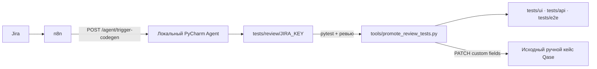

# База знаний проекта `autotest_mobile`

## Назначение

Проект содержит Android UI/E2E-тесты на Appium и API-тесты на pytest. Он
принимает ручные тест-кейсы из n8n, генерирует тесты для ревью, проверяет их и
после одобрения переносит в постоянные наборы.



## Структура и ответственные файлы

| Путь | Назначение |
| --- | --- |
| `tools/n8n_agent_server.py` | HTTP-агент n8n на порту 5000; генерация тестов и автозапуск Appium для входящих Android UI/E2E задач. |
| `run/venv/start_n8n_agent.bat` | Рекомендуемый запуск агента: читает секреты из игнорируемого `.n8n-agent.env`. |
| `tools/promote_review_tests.py` | Проверка и перенос тестов из review в постоянные каталоги. |
| `tools/sync_qase_coverage.py` | Заполняет поля покрытия исходного ручного кейса Qase. |
| `clients/qase_api_client.py` | Минимальный клиент Qase API для обновления custom fields. |
| `tests/review/manifest.json` | Реестр сгенерированных тестов: `pending_review` или `promoted`. |
| `tests/ui`, `tests/api`, `tests/e2e` | Постоянные наборы проверенных тестов. |
| `.github/workflows/promote-approved-tests.yml` | Ручной GitHub Actions workflow для промоута на self-hosted Windows runner. |

В проекте нет актуальных корневых файлов `agent_codegen.py`,
`promote_review_tests.py` и `sync_autotests.py`: используйте пути из таблицы.

## Секреты и конфигурация

Никогда не добавляйте значения токенов в Git, документацию, n8n node parameters
или чат. Файлы `.env` и `.n8n-agent.env` игнорируются Git.

| Где | Переменные |
| --- | --- |
| `.n8n-agent.env` на рабочей машине | `OPENAI_API_KEY`, `N8N_AGENT_TOKEN`, при необходимости `N8N_AGENT_HOST`, `N8N_AGENT_PORT`. |
| `.env` на рабочей машине | `QASE_API_TOKEN`, `QASE_PROJECT_CODE`, `QASE_FIELD_AUTOMATION_*`, параметры Android и тестового пользователя. |
| GitHub repository secrets | `QASE_API_TOKEN`, `TEST_PHONE`. |

Если секрет когда-либо попал в коммит, лог, скриншот или документацию, его
нужно отозвать и выпустить новый в соответствующем сервисе.

## Локальный агент n8n

Запуск из корня проекта:

```powershell
run\venv\start_n8n_agent.bat
```

Проверка доступности:

```powershell
Invoke-RestMethod http://127.0.0.1:5000/health
```

Для n8n, работающего в Docker, используется:

```text
POST http://host.docker.internal:5000/agent/trigger-codegen
Authorization: Bearer <N8N_AGENT_TOKEN>
```

Appium **не запускается при старте HTTP-агента**. Агент проверяет и запускает
его только во время обработки Android-кейсов типа `UI` или `E2E`.

### Контракт запроса n8n

```json
{
  "task": "Сгенерируй Android-автотесты по ручным кейсам",
  "platform": "android",
  "jiraKey": "KAN-4",
  "apply": true,
  "testCases": [
    {
      "id": "KAN-4-1162",
      "qaseCaseId": 1162,
      "title": "Кнопка «Мои покупки» отображается на главном экране",
      "type": "UI",
      "steps": [
        {
          "action": "Открыть главный экран",
          "expected": "Кнопка видима и доступна"
        }
      ]
    }
  ]
}
```

Обязательные поля каждого кейса: `id`, `title`, непустой список `steps`, а у
каждого шага — `action` и `expected`. `qaseCaseId` необязателен, но для связи с
Qase должен быть числовым. При наличии этого поля агент требует добавить в
тест `@pytest.mark.qase_case("<ID>")`.

При `apply: true` тесты появляются в `tests/review/<JIRA_KEY>/<ui|api|e2e>/`,
получают `@pytest.mark.review`, а в `tests/review/manifest.json` создаётся
запись `pending_review`. При `apply: false` изменения только возвращаются в
HTTP-ответе.

## Проверка и промоут

Проверка конкретной задачи:

```powershell
.venv\Scripts\python.exe -m pytest tests/review/KAN-4/ -v
```

Промоут выполняется только после одобрения ревью:

```powershell
.venv\Scripts\python.exe tools/promote_review_tests.py KAN-4 --verify --apply
```

Скрипт блокирует файлы с `pass`, `TODO`, заглушками и существующим файлом в
целевом каталоге. После успешной проверки он переносит файлы в `tests/ui`,
`tests/api` или `tests/e2e`, убирает `@pytest.mark.review` и меняет запись
манифеста на `promoted`.

## Qase: учёт покрытия без дубликатов

В Qase не создаются отдельные автотест-кейсы. Исходный ручной кейс остаётся со
системным статусом `Manual`; меняются только проектные custom fields:

| Поле | Значение после промоута |
| --- | --- |
| Automation Coverage | `Automated` |
| Automation Type | `UI`, `API` или `E2E` |
| Automation Code Path | Путь к Python-тесту в репозитории |
| Automation Test ID | Allure ID теста, например `KAN-4-1162` |
| Automation Note | Отметка о поддерживаемом проверенном тесте |

Qase обновляется только для тест-функций с явным маркером
`@pytest.mark.qase_case("<числовой ID ручного Qase-кейса>")`. Это исключает
обновление неправильного кейса по совпадению названий.

## GitHub Actions

Workflow **Promote Approved Tests** запускается вручную в разделе
`Actions → Promote Approved Tests → Run workflow` и требует Jira key.

Он использует self-hosted Windows runner, потому что GitHub-hosted runner не
содержит установленное мобильное приложение и доступный Android-эмулятор.
Перед запуском runner должен иметь:

- `adb`, Appium и подключённый Android-эмулятор/устройство;
- установленное приложение `com.sminex.sminex_app`;
- доступные GitHub secrets `QASE_API_TOKEN` и `TEST_PHONE`;
- права GitHub Actions на запись содержимого репозитория.

Workflow запускает pytest, выполняет промоут, обновляет Qase при наличии
`qase_case` маркера и коммитит изменения внутри `tests/`. Локальная проверка
остается основным способом отладки Appium-сценариев.

`Verify Review Tests CI` существует для pull request, но для UI/E2E ему также
нужен Android-совместимый runner; не считайте GitHub-hosted Ubuntu runner
достаточной средой для мобильной проверки.
